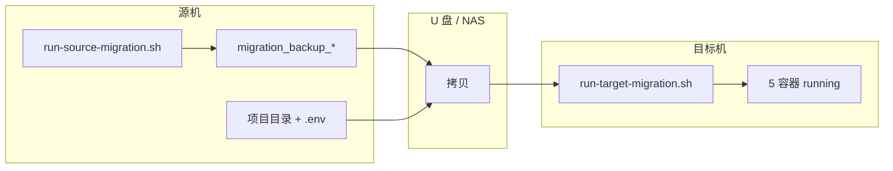

# 硬件研发部系统 — 离线迁移手册

本文档说明如何将 **Docker Compose 单机栈** 从一台 Linux 服务器**完整离线迁移**到另一台机器（不访问互联网拉取镜像）。  
已在 `zzw-VirtualBox`（Ubuntu 18.04 / x86_64）上演练通过。

日常运维（启停、日志、备份）见 [`运维手册.md`](运维手册.md)。  
**只迁部分数据**（如公告栏到新服务器）见 [`数据迁移指南.md`](数据迁移指南.md)。

---

## 1. 迁移原理



| 迁移内容 | 方式 | 说明 |
|---------|------|------|
| 应用镜像 | `stack_images.tar`（`docker save`） | mysql、nginx、htmlsystm、backend、web |
| 业务数据 | 4 个命名卷 `.tar.gz` | MySQL、公告、上传、NEO 数据 |
| 配置与密钥 | 根目录 `.env` | 含密码、API Key，**勿提交 Git** |
| 网关证书 | `gateway/certs/` | IP 变更时需重签 |

**目标机启动方式**：`docker load` 加载镜像后，`docker compose up -d`（**不 build、不 pull**）。

---

## 2. 迁机前必读

### 2.1 CPU 架构必须一致

```bash
uname -m    # x86_64 或 aarch64
```

| 源机架构 | 目标机架构 | 能否直接离线迁镜像 |
|---------|-----------|-------------------|
| x86_64 | x86_64 | ✅ 可以 |
| aarch64 | aarch64 | ✅ 可以 |
| x86_64 | aarch64（或相反） | ❌ **不行** |

跨架构时：数据卷和项目代码仍可迁移，但镜像需在目标架构上重新 `docker compose build`（需网络或预构建）。

### 2.2 `COMPOSE_PROJECT_NAME` 源目标必须一致

```bash
grep COMPOSE_PROJECT_NAME .env
```

当前生产环境示例为 `docker`，对应卷名：

- `docker_mysql_data`
- `docker_htmlsystm_data`
- `docker_htmlsystm_uploads`
- `docker_ai_chatroom_data`

**目标机 `.env` 必须与源机相同**。改名会挂到新空卷，积分/公告会「归零」。

### 2.3 迁机期间服务会短暂停机

源机执行 `02-backup-volumes.sh` 时会 `docker compose stop`，备份完成前用户无法访问。请选择业务低峰操作。

### 2.4 备份体积参考（实测）

一次完整备份约 **1.8 GB**，主要占用：

| 文件 | 约大小 |
|------|--------|
| `stack_images.tar` | ~1.6 GB |
| `mysql_data.tar.gz` | ~13 MB |
| `htmlsystm_data.tar.gz` | ~116 MB |
| `ai_chatroom_data.tar.gz` | ~11 KB |
| `htmlsystm_uploads.tar.gz` | ~87 B |
| `alpine_helper.tar` | ~7.4 MB |

---

## 3. 源机操作（打包）

在**当前正在运行的源机**上执行（示例路径 `~/rk3568/docker版本`）。

### 3.1 准备脚本

```bash
cd ~/rk3568/docker版本
chmod +x migration/*.sh scripts/*.sh
sed -i 's/\r$//' migration/*.sh    # Windows 编辑过的脚本先去 CRLF
```

### 3.2 确认栈在运行

```bash
docker compose ps
# mysql / htmlsystm / backend / web / gateway 均应为 running（htmlsystm 须 healthy）
uname -m
```

### 3.3 一键离线打包

```bash
# 栈已在跑、镜像齐全：跳过 build 和 pull，绝不访问互联网
SKIP_BUILD=1 SKIP_PULL=1 ./migration/run-source-migration.sh
```

脚本依次执行：

1. `01-record-state.sh` — 记录架构、卷名、镜像列表
2. `02-backup-volumes.sh` — **停栈**，打包 4 个数据卷
3. `03-export-images.sh` — 导出全部镜像到 `stack_images.tar`
4. `04-transfer-checklist.sh` — 生成拷贝清单

完成后生成目录，例如：

```
~/rk3568/docker版本/migration_backup_20260517_131328/
```

### 3.4 补充 alpine 辅助镜像（必做）

恢复卷时脚本会用到 `alpine:3.19`，默认导出**不包含**此镜像，需手动保存：

```bash
BACKUP_DIR=$(ls -dt ~/rk3568/docker版本/migration_backup_* | head -1)
docker save -o "${BACKUP_DIR}/alpine_helper.tar" alpine:3.19
```

### 3.5 核对备份完整性

```bash
ls -lh "${BACKUP_DIR}/"
```

**必须有以下文件**（缺一不可）：

```
stack_images.tar          # 全部应用镜像
alpine_helper.tar         # 卷恢复辅助镜像
mysql_data.tar.gz
htmlsystm_data.tar.gz
htmlsystm_uploads.tar.gz
ai_chatroom_data.tar.gz
images_list.txt
migration_state.txt
```

`images_list.txt` 正常应含：

```
docker-backend:latest
docker-htmlsystm:latest
docker-web:latest
mysql:8.0
nginx:alpine
```

### 3.6 源机重新启动（可选）

若迁机尚未完成、仍需对外服务，可在源机重新启动：

```bash
cd ~/rk3568/docker版本
docker compose up -d
```

---

## 4. 拷贝到目标机

### 4.1 必拷内容

| 内容 | 说明 |
|------|------|
| **整个项目目录** | 含 `docker-compose.yml`、`gateway/`、`htmlsystm/`、`neo_ai_chatroom/`、`migration/` |
| **`.env`** | 含密码和 API 密钥 |
| **`migration_backup_YYYYMMDD_HHMMSS/`** | 上一步生成的备份目录 |

可省略：`node_modules/`（离线启动用已 load 镜像，无需 build）。

### 4.2 可选：Docker 离线安装包

目标机若未安装 Docker，需提前准备（按目标机 `uname -m` 选择）：

- `docker.io` 及依赖的 `.deb` 包（Ubuntu）
- Compose V2 插件二进制：`docker-compose-linux-x86_64` 或 `docker-compose-linux-aarch64`

安装验证：

```bash
docker version
docker compose version
sudo usermod -aG docker $USER
newgrp docker
```

### 4.3 生成拷贝清单（可选）

```bash
./migration/04-transfer-checklist.sh ~/rk3568/docker版本/migration_backup_YYYYMMDD_HHMMSS
# 清单写入 migration/TRANSFER_MANIFEST.txt
```

---

## 5. 目标机操作（恢复）

在目标机放置项目后执行（示例路径 `~/rk3568/docker版本`）。

### 5.1 准备环境

```bash
cd ~/rk3568/docker版本
chmod +x migration/*.sh
sed -i 's/\r$//' migration/*.sh .env
```

### 5.2 修改 `.env`（必做）

```bash
vim .env
```

至少确认以下项：

```bash
COMPOSE_PROJECT_NAME=docker                              # 与源机完全一致
MYSQL_PASSWORD=...                                       # 与源机一致（卷内已是旧密码）
GATEWAY_PUBLISH_PORT=8000
PUBLIC_BASE_URL=https://新服务器IP:8000                   # 小写 https://，无末尾斜杠
```

> **注意**：仅改 `.env` 中的 `MYSQL_PASSWORD` 不会自动修改卷内 MySQL 密码。须保持与源机相同，或迁机后用 `migration/fix-mysql-and-admin.sh` 对齐。

### 5.3 IP 变更时重签 TLS 证书

```bash
bash migration/gen-gateway-cert.sh 192.168.x.x    # 换成目标机实际 IP
```

### 5.4 指定真实备份路径（常见踩坑）

**不要使用文档中的占位符 `YYYYMMDD_HHMMSS`**，必须换成实际目录名：

```bash
# ✅ 正确：使用真实路径
BACKUP=~/rk3568/docker版本/migration_backup_20260517_131328

# ❌ 错误：占位符未替换会导致脚本直接退出、容器不会启动
BACKUP=~/rk3568/docker版本/migration_backup_YYYYMMDD_HHMMSS
```

确认备份文件存在：

```bash
ls -lh "${BACKUP}/"
```

### 5.5 一键离线恢复

```bash
./migration/run-target-migration.sh "${BACKUP}"
```

脚本依次执行：

1. `05-target-load-images.sh` — `docker load` 加载 `stack_images.tar`
2. `06-target-restore-volumes.sh` — 用 `alpine:3.19` 解压 4 个卷到 `docker_*` 卷
3. `07-target-up-verify.sh` — `docker compose up -d`（**离线模式，不 build**）+ HTTPS 自检

### 5.6 成功标志

终端输出应类似：

```
Loaded image: mysql:8.0
Loaded image: nginx:alpine
Loaded image: docker-backend:latest
Loaded image: docker-htmlsystm:latest
Loaded image: docker-web:latest
...
启动栈（离线模式，不 --build）...
stack-mysql        Healthy
stack-htmlsystm    Healthy
stack-neo-backend  Started
stack-neo-web      Started
stack-gateway      Started
  /login -> HTTPS 200
  /neo/  -> HTTPS 200
```

---

## 6. 验收

### 6.1 命令行自检

```bash
bash migration/check-stack.sh

curl -sk https://127.0.0.1:8000/neo/api/health/persistence | python3 -m json.tool
# storage 应为 mysql；若源机有积分记录，pointEventsCount > 0
```

### 6.2 浏览器验收

访问（**必须用 `https://`**）：

- 管理系统：`https://<目标机IP>:8000/login`
- NEO：`https://<目标机IP>:8000/neo/`

检查项：

- [ ] 管理员登录正常
- [ ] 公告、上传文件、历史数据完整
- [ ] NEO 对话与积分/看板正常
- [ ] 钉钉工作通知跳转 URL 正确（依赖 `PUBLIC_BASE_URL`）

### 6.3 防火墙（Ubuntu）

```bash
sudo ufw allow 8000/tcp
sudo ufw status
```

---

## 7. 同机演练注意事项

在同一台虚拟机上用「复制目录」测试迁机时（如 `docker_copy_test版本`），须先停掉原栈，否则会抢容器名和端口：

```bash
cd ~/rk3568/docker版本
docker compose down
docker ps    # 确认无 stack-* 容器

cd ~/rk3568/docker_copy_test版本
BACKUP=~/rk3568/docker_copy_test版本/migration_backup_20260517_131328
./migration/run-target-migration.sh "${BACKUP}"
```

演练通过后，若要恢复运行原目录，同样先停测试栈再启原栈。

---

## 8. 要不要手动 build？

| 情况 | 操作 |
|------|------|
| `run-target-migration.sh` **成功跑完** | **不要** build，默认 `NO_BUILD=1` 离线启动 |
| `stack_images.tar` 缺失或 load 失败 | 检查备份；无法在目标机离线恢复时需重新在源机打包 |
| 源目标 CPU 架构不同 | 不能 load 镜像；目标机需 `docker compose up -d --build`（需网络） |
| 仅代码小改、同机重建 | `docker compose up -d --build`（保留卷，安全） |

---

## 9. 分步脚本速查

若一键脚本某步失败，可单独重跑：

| 阶段 | 脚本 | 作用 |
|------|------|------|
| 源机 | `01-record-state.sh` | 记录源机状态 |
| 源机 | `02-backup-volumes.sh` | 停栈后备份四卷 |
| 源机 | `03-export-images.sh` | 导出镜像 tar |
| 源机 | `04-transfer-checklist.sh` | 生成拷贝清单 |
| 目标机 | `05-target-load-images.sh` | load 镜像 |
| 目标机 | `06-target-restore-volumes.sh` | 恢复四卷 |
| 目标机 | `07-target-up-verify.sh` | 启动并 HTTPS 自检 |

分步恢复示例：

```bash
BACKUP=~/rk3568/docker版本/migration_backup_20260517_131328

docker load -i "${BACKUP}/alpine_helper.tar"    # 若本机无 alpine:3.19
./migration/05-target-load-images.sh "${BACKUP}/stack_images.tar"
./migration/06-target-restore-volumes.sh "${BACKUP}"
NO_BUILD=1 ./migration/07-target-up-verify.sh
```

---

## 10. 常见问题

| 现象 | 原因与处理 |
|------|-----------|
| 恢复后无容器、`check-stack.sh` 为空 | `BACKUP` 路径写错（占位符未替换）；`run-target-migration.sh` 未真正执行 |
| `用法: run-target-migration.sh <备份目录>` | 备份目录不存在或路径错误 |
| 容器名冲突 | 源机旧栈未 `docker compose down`；或同机两套目录同时启动 |
| 端口 8000 被占用 | 先停掉另一套栈：`docker compose down` |
| 积分/公告归零 | `COMPOSE_PROJECT_NAME` 与源机不一致，挂到新空卷 |
| `htmlsystm unhealthy` | MySQL 密码与卷内不一致 → `bash migration/fix-mysql-and-admin.sh '你的密码'` |
| 网关 Restarting | `docker logs stack-gateway --tail 50`；检查证书与 nginx 配置 |
| compose 仍尝试 pull/build | 确认 `docker load` 成功；`cat images_list.txt` 与 `docker images` 一致 |
| 页面白屏 / chrome-error | 须用 `https://` 而非 `http://` |
| 改 `.env` 密码后库连不上 | 卷内密码未变；用 `fix-mysql-and-admin.sh`，**不要** `docker compose down -v` |

---

## 11. 迁机后建议

1. **记录台账**（日期、操作人、备份路径、验收结果）。
2. **保留源机备份**至少 4 周，确认目标机稳定后再清理。
3. 目标机稳定后配置每周自动备份：`./scripts/backup-all.sh`（见运维手册第 6 章）。
4. 每季度在测试环境演练一次完整迁机流程。

---

## 12. 命令速记（复制即用）

### 源机打包

```bash
cd ~/rk3568/docker版本
chmod +x migration/*.sh && sed -i 's/\r$//' migration/*.sh
SKIP_BUILD=1 SKIP_PULL=1 ./migration/run-source-migration.sh
BACKUP_DIR=$(ls -dt migration_backup_* | head -1)
docker save -o "${BACKUP_DIR}/alpine_helper.tar" alpine:3.19
ls -lh "${BACKUP_DIR}/"
```

### 目标机恢复

```bash
cd ~/rk3568/docker版本
chmod +x migration/*.sh && sed -i 's/\r$//' migration/*.sh .env
# 编辑 .env：PUBLIC_BASE_URL、COMPOSE_PROJECT_NAME
bash migration/gen-gateway-cert.sh <新IP>    # IP 变更时
BACKUP=~/rk3568/docker版本/migration_backup_20260517_131328   # 换成实际目录名
./migration/run-target-migration.sh "${BACKUP}"
bash migration/check-stack.sh
```

---

## 13. 相关文档

- 文档入口：[README.md](README.md)
- 日常运维：[运维手册.md](运维手册.md)
- 选择性数据迁移（公告栏等）：[数据迁移指南.md](数据迁移指南.md)
- TLS 证书：执行 `bash migration/gen-gateway-cert.sh <IP>`，证书目录 `gateway/certs/`
- 迁移脚本目录：[migration/](migration/)
